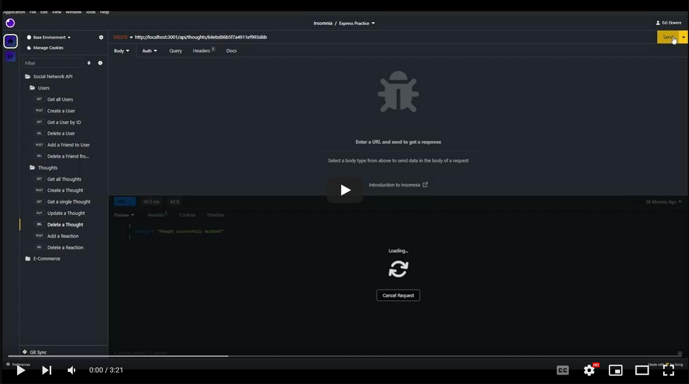
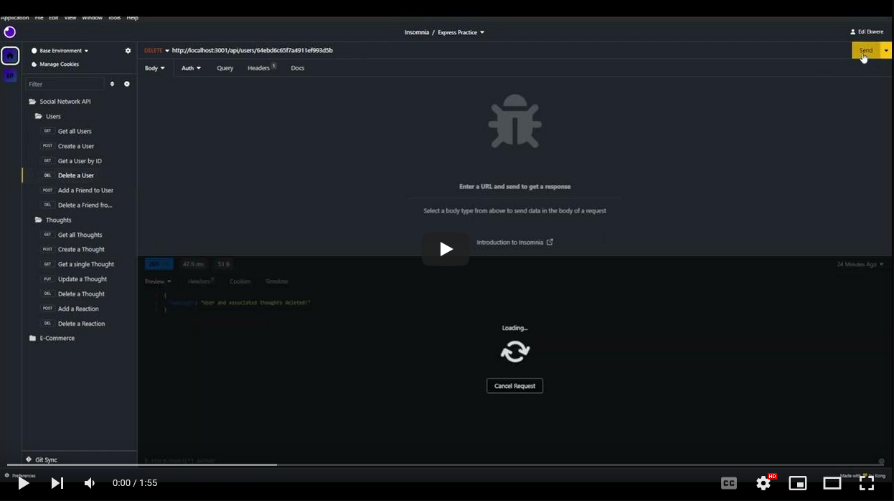

# Social-Experiment

An API Backend for a social media platform.
  
## Description
  
A NodeJS and MySQL powered Social Media Back End.

It utilizes several key npm technologies.
  
## Table of Contents
  
- [Installation](#installation)
- [Usage](#usage)
- [License](#license)
- [Contributing](#contributing)
- [Media](#media)
- [Credits](#credits)
  
## Installation
  
  You must have NodeJS and MySQL installed on your computer.

- Clone the repo to your local storage.
- Open the folder in a git bash or powershell terminal.
- Run `npm i` to install the necessary packages.
- Run `node server.js` to start the backend.

## Technologies


- NPM Express
- NPM Moment
- NPM Mongoose
  
## Usage

Going to start doing them like this from now on.

Upon running `node server.js` in a terminal, the user will be allowed to access the database using a program like Insomnia.

The API will take `GET`, `POST`, `PUT`, and `DELETE` calls for different params.

```
AS A social media startup
I WANT an API for my social network that uses a NoSQL database
SO THAT my website can handle large amounts of unstructured data
```

```
GIVEN a social network API
WHEN I enter the command to invoke the application
THEN my server is started and the Mongoose models are synced to the MongoDB database
WHEN I open API GET routes in Insomnia for users and thoughts
THEN the data for each of these routes is displayed in a formatted JSON
WHEN I test API POST, PUT, and DELETE routes in Insomnia
THEN I am able to successfully create, update, and delete users and thoughts in my database
WHEN I test API POST and DELETE routes in Insomnia
THEN I am able to successfully create and delete reactions to thoughts and add and remove friends to a user’s friend list
```

## License
  
  

  This project is covered under the MIT license.
  
## Contributing
  
N/A
  
## Media

Click to watch the full video on YouTube!

  [](https://youtu.be/7xM2FxEsmD0)
  [](https://youtu.be/DTtLZC5Zr8A)

## Credits

  Ediubong Ekwere | JunoAndIce\
  Joey Lee | Rockojoe2

  <https://github.com/JunoAndIce> | [ekwere.edi@gmail.com](mailto:ekwere.edi@gmail.com)\
  <https://github.com/Rockojoe2>
